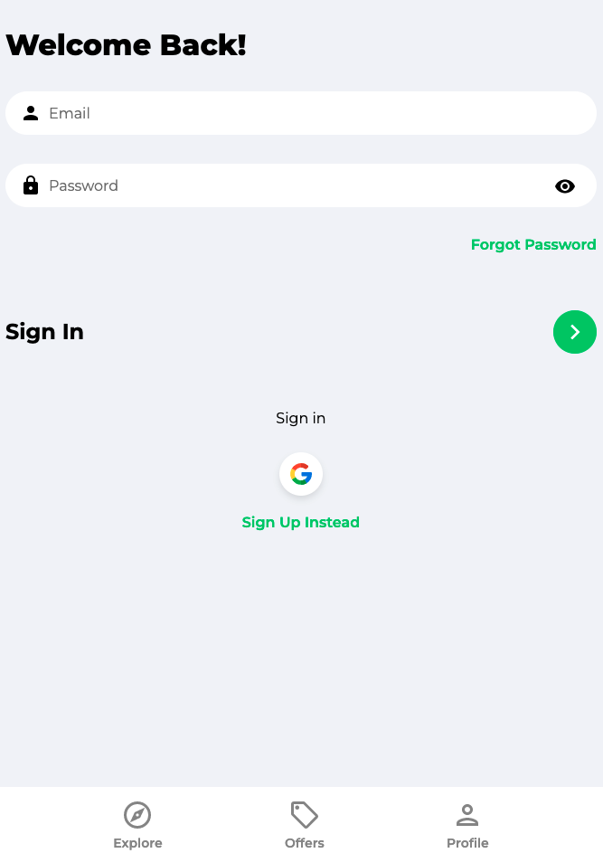
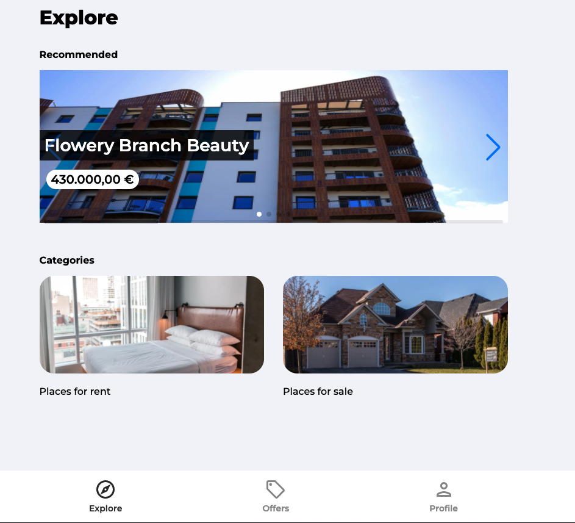
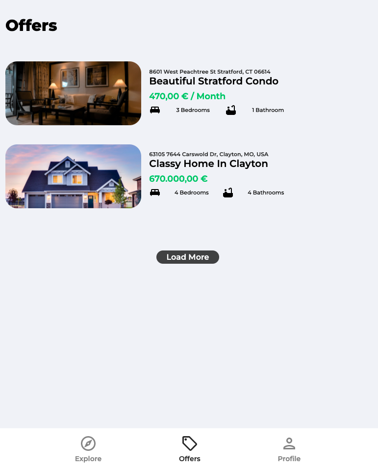
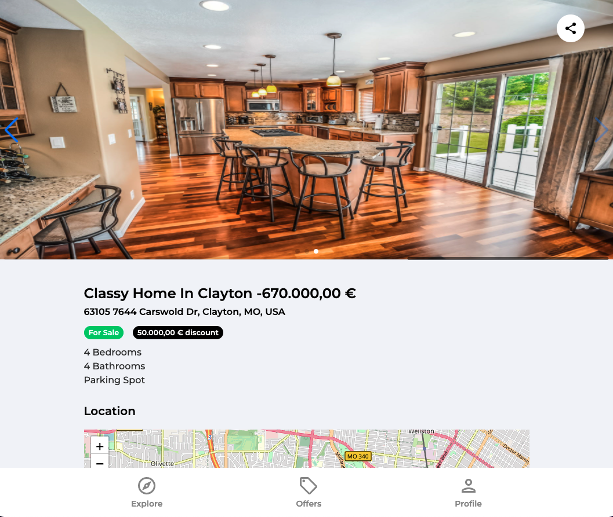
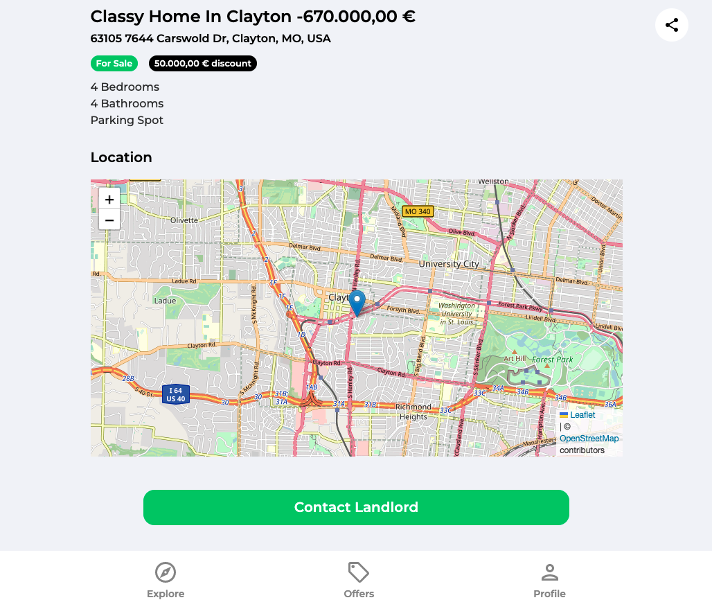
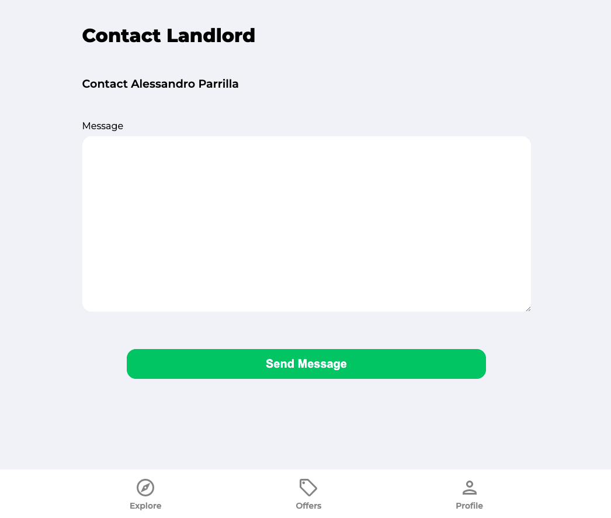
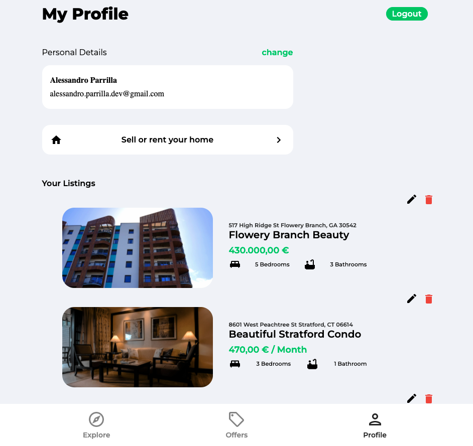

# HOUSE MARKETPLACE REACT

<details open="open">
  <summary><h2 style="display: inline-block">Contents</h2></summary>
  <ol>
    <li>
      <a href="#about-the-project">About The Project</a>
      <ul>
        <li><a href="#sign-in">Sign In</a></li>
        <li><a href="#offers-page">Offers Page</a></li>
        <li><a href="#explore-page">Explore Page</a></li>
        <li><a href="#offers-page">Offers Page</a></li>
         <li><a href="#listing-page">Listing Page</a></li>
        <li><a href="#contact-landlord">Contact Landlord Page</a></li>
        <li><a href="#profile-page">Profile Page</a></li>
        <li><a href="#create-listing">Create Listing Page</a></li>
        <li><a 
        href="#built-with">Built With</a></li>
      </ul>
    </li>
    <li>
      <a href="#getting-started">Getting Started</a>
      <ul>
        <li><a href="#prerequisites">Prerequisites</a></li>
        <li><a href="#installation">Installation</a></li>
      </ul>
    </li>
    <li><a href="#links-contacts">Links & Contacts</a></li>
  </ol>
</details>


## About The Project

### Sign In

<div align='center'>

</div>
<br>

You can register with email and password on the Sign Up page or you can use Google Auth with a google email 


### Explore Page

<div align='center'>

</div>
<br>
Explore page shows a slide with the recommended listings and the two types of listing categories for sale or for rent.

### Offers Page

<div align='center'>

</div>
<br>
In the offer page you can see the listings currently offering a discount on the price

### Listing Page

<div align='center'>

</div>
<br>

The Listing Page shows an impressive slide at the top of the page with the images of the listed house, these images once inserted are saved in the [Firebase Storage](https://firebase.google.com/)

<div align='center'>

</div>
<br>

Continuing below with the listing there are the details of the house and coordinates of the owner's address.

You can click on "Contact Landlord" to open the page to contact him/her.


### Contact Landlord

<div align='center'>

</div>
<br>

In this page you can write a message and once you click on "Send Message" the email app will start and precompile the email to the landlord.


### Profile Page

<div align='center'>

</div>
<br>

In the profile section you will see personal details such as name and email, you can change the name by clicking on the "change" button.

You can logout and there are your listings, you can edit or delete them.

### Create Listing
<div align='center'>

</div>
<br>

### Built With
* [REACT JS](https://it.reactjs.org/)
* [FIREBASE](https://firebase.google.com/)

## Getting Started

### Prerequisites

To start the application you need to have Node.js installed on your computer, so to install the latest version run the following command:

  ```sh
  npm install npm@latest -g
  ```

### Installation

1. Clone the repository with git in the path you prefer:
```sh
 git clone https://github.com/parrodiv/HouseMarketplaceReact.git
```

2. Install NPM packages
 ```sh
  npm install
 ```

3. Start development
 ```sh
  npm start
 ```


4. Build:
```sh
  npm run build
```

5. Open build/index.html

## Links & Contacts
Linkedin - [Alessandro Parrilla](https://www.linkedin.com/in/alessandro-parrilla-994931222/) - alessandro.parrilla.dev@gmail.com

Website: https://house-marketplace-react-eosin.vercel.app/